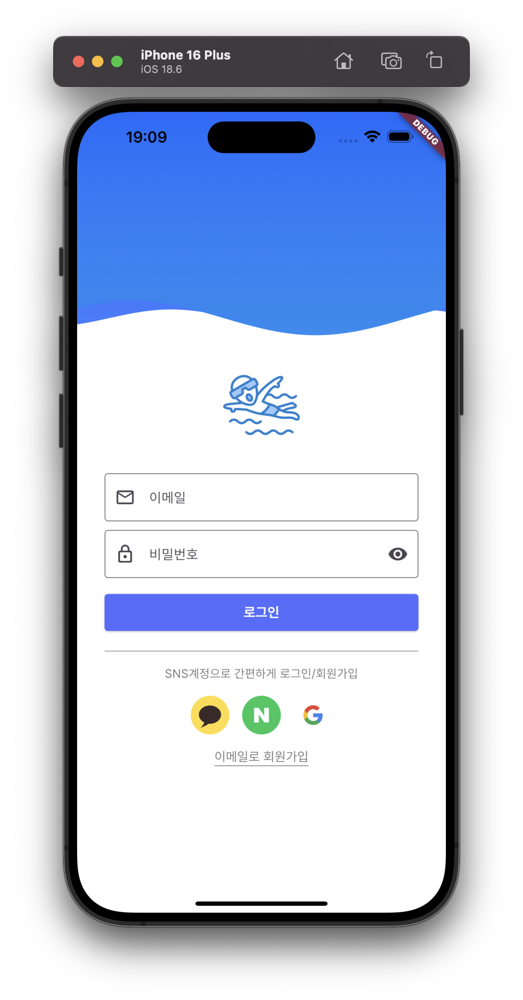
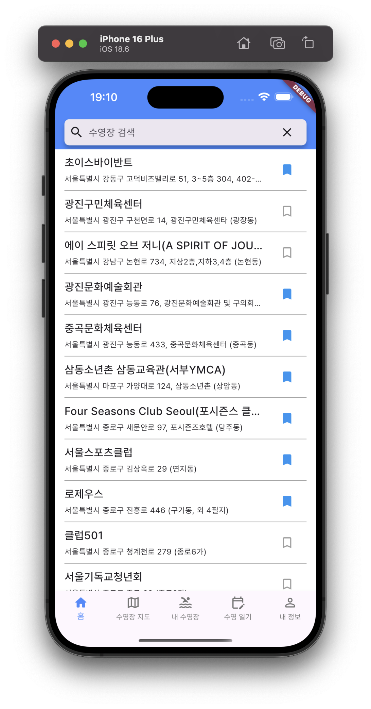
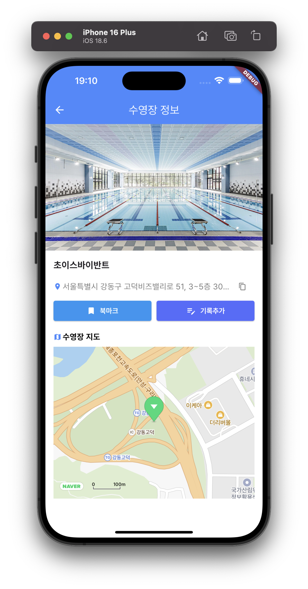
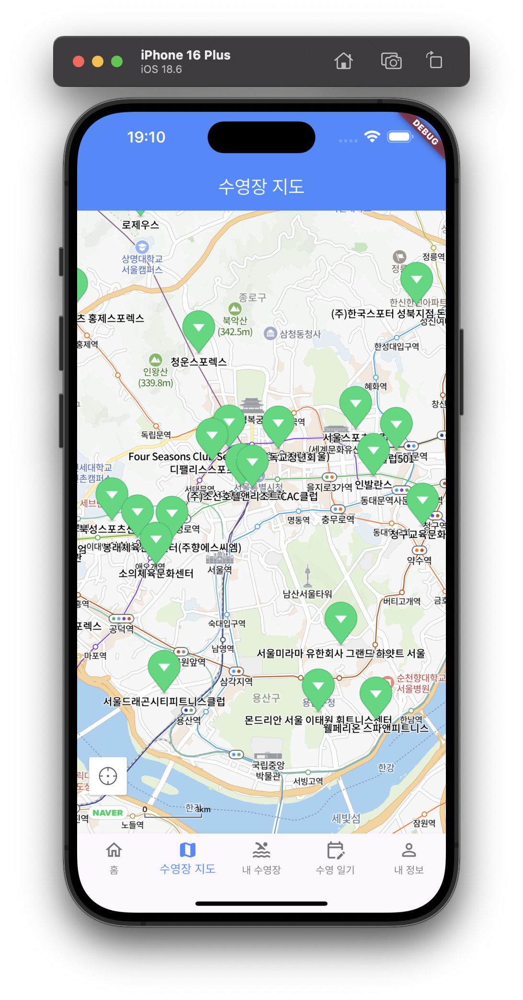
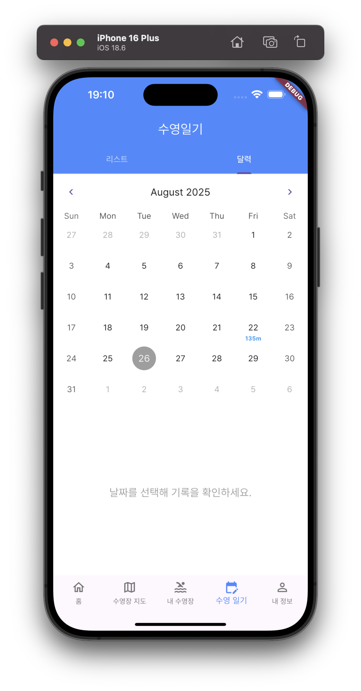

# Surin-e Project

수영장 찾기 및 수영 기록 저장 토이프로젝트
(모바일앱 코드는 모두 chatgpt, gemini 등 AI를 적극 활용함)
## 프로젝트 구조

```
surin-e/
├── backend/          # FastAPI 백엔드 서버
├── mobile/           # Flutter 모바일 앱
└── README.md
```

## 어플 스크린샷







